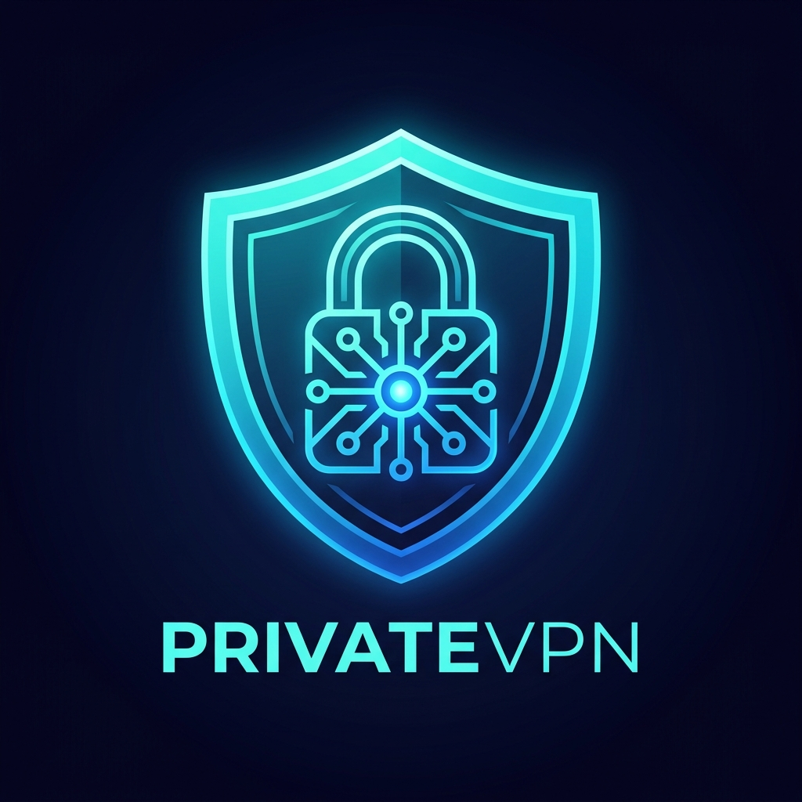
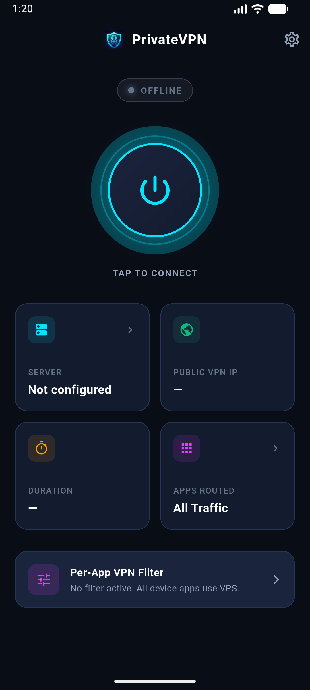
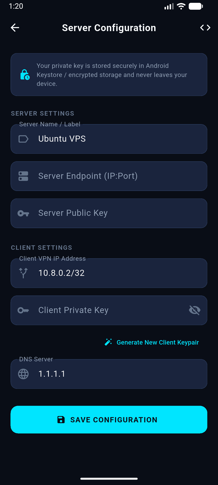
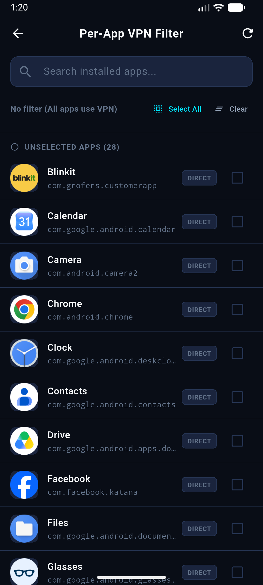
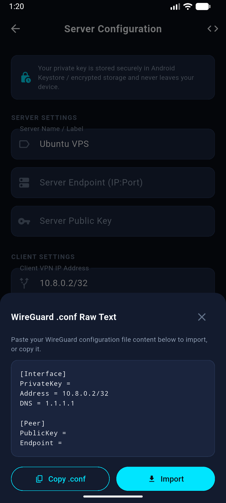

<p align="center">
  
</p>

<h1 align="center">PrivateVPN</h1>

<p align="center">
  <strong>Fast, Self-Hosted, Privacy-First WireGuard® VPN for Android</strong>
</p>

<p align="center">
  <a href="https://github.com/0xrohitsen/PrivateVPN/releases/latest">
    
  </a>
  <a href="https://github.com/0xrohitsen/PrivateVPN/blob/main/LICENSE">
    
  </a>
  
  
  
</p>

<br>

<p align="center">
  <a href="https://github.com/0xrohitsen/PrivateVPN/releases/download/v1.0.0/PrivateVPN-v1.0.0.apk">
    
  </a>
  &nbsp;&nbsp;
  <a href="https://github.com/0xrohitsen/PrivateVPN/releases/latest">
    
  </a>
</p>

<br>

---

## 📸 App Screenshots

<p align="center">
  
  &nbsp;
  
  &nbsp;
  
  &nbsp;
  
</p>

---

## 🌟 Highlights

- 🚀 **100% Self-Hosted & Zero Logs:** Your private server, your encryption keys, zero third-party intermediaries.
- ⚡ **WireGuard Native Performance:** Powered by the official Android `GoBackend` engine for peak speed, minimal ping, and battery efficiency.
- 🎛️ **Per-App VPN Filter (Split Tunneling):** Choose precisely which apps route through your VPS and which apps bypass the VPN.
- 🔄 **Tunnel State Recovery:** Built with process-level singleton management so tunnel states never drop when swiping from recent apps.
- 👥 **Multi-Device Server Manager:** 1-Click interactive script to generate, manage, list, and revoke configurations for all your devices.
- 🎨 **Material 3 Dark UI:** Sleek UI with live duration timers, live public IP resolver, and connection animations.

---

## 🏗️ Architecture

```text
┌─────────────────────────────────────────────────────────────┐
│                    PrivateVPN Android App                   │
├─────────────────────────┬───────────────────────────────────┤
│    Flutter UI Layer     │ Material 3, Dark Mode, Diagnostics │
├─────────────────────────┼───────────────────────────────────┤
│    Native Kotlin Layer  │ MethodChannel, Foreground Service │
├─────────────────────────┼───────────────────────────────────┤
│    WireGuard Engine     │ WireGuard-Android GoBackend       │
└────────────┬────────────────────────────┬───────────────────┘
             │                            │
      Encrypted Traffic             Direct Traffic
      (Selected Apps)              (Bypassed Apps)
             │                            │
             ▼                            ▼
   ┌───────────────────┐             ┌────────┐
   │ Private VPS (wg0) │             │ Normal │
   │ WireGuard Server  │             │  ISP   │
   └─────────┬─────────┘             └────────┘
             │
      Public Internet
```

---

## ⚡ 1-Minute Server Setup (Ubuntu / Debian VPS)

Run this one-line command on your Ubuntu (20.04/22.04/24.04/26.04) or Debian VPS as `root`:

```bash
curl -fsSL https://raw.githubusercontent.com/0xrohitsen/PrivateVPN/main/scripts/privatevpn-server.sh | sudo bash
```

### 🎮 Interactive Server Control Panel

Running the script anytime brings up the interactive control panel:

```text
=====================================================
          PrivateVPN — Server Manager                
=====================================================
Server IP: 62.238.101.17 | Port: 51820 | Status: ACTIVE
Configured Peers: 3
-----------------------------------------------------
  1) ➕ Add / Generate New Device Client
  2) 📊 List Connected Devices & Live Traffic Stats
  3) 🔍 View Device Config & QR Code
  4) 🗑️  Remove / Revoke Device Client
  5) 🔄 Restart WireGuard Server
  6) ⚠️  Uninstall WireGuard Server
  7) 🚪 Exit
-----------------------------------------------------
Choose an option [1-7]:
```

---

## 📱 Android App Setup

### 📥 1. Download & Install APK
- Download the latest signed release: **[PrivateVPN-v1.0.0.apk](https://github.com/0xrohitsen/PrivateVPN/releases/download/v1.0.0/PrivateVPN-v1.0.0.apk)**
- Open and install on your phone.

### ⚙️ 2. Configuration Options

#### Method 1: 1-Click `.conf` Import (Recommended)
1. Copy the `.conf` generated by the VPS server script.
2. In the PrivateVPN app, tap **Settings (⚙️)** → **Import / Export**.
3. Paste the configuration and tap **Save**.

#### Method 2: Manual Credentials Entry
In **Settings (⚙️)**, enter the generated credentials:
- **Server Endpoint:** `YOUR_SERVER_IP:51820`
- **Server Public Key:** `Server public key from setup`
- **Client Address:** `10.8.0.X/32` *(Must match the specific device IP)*
- **Client Private Key:** `Client private key from setup`
- **DNS:** `1.1.1.1`

---

## 🛠️ Building From Source

### Prerequisites
- [Flutter SDK](https://flutter.dev/docs/get-started/install) (3.x or later)
- Android SDK (API level 34+)
- JDK 17

```bash
# 1. Clone the repository
git clone https://github.com/0xrohitsen/PrivateVPN.git
cd PrivateVPN

# 2. Install dependencies
flutter pub get

# 3. Build Signed Release APK
flutter build apk --release
```

Output APK will be generated at: `build/app/outputs/flutter-apk/app-release.apk`

---

## 🔒 Security & Privacy

- **No Third-Party Trackers:** Zero telemetry, no ad networks, no data collection.
- **Cryptographic Security:** Built strictly with WireGuard standard cryptography (Noise protocol framework, Curve25519, ChaCha20, Poly1305, BLAKE2s).
- **Isolated Routing:** Firewall isolation guarantees that only client traffic (`10.8.0.0/24`) is routed through NAT Masquerading.

---

## 📄 License

This project is open-source software licensed under the [MIT License](LICENSE).
